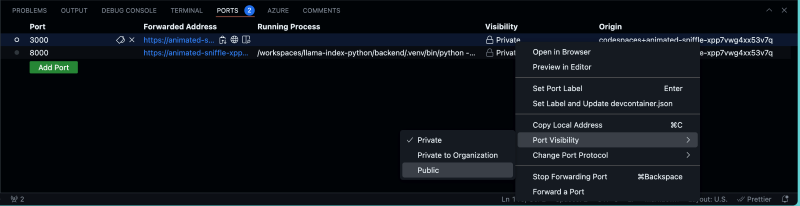

# Clinical Rounds App

Clinical Rounds App is an app that will help you find patients.

This repo demonstrates how to create and work with AI agents driven by [Azure OpenAI](https://learn.microsoft.com/en-us/azure/ai-services/openai/). It includes a FastAPI app that takes a topic and instruction from a user and then calls a research agent that uses the [Bing Grounding Tool](https://learn.microsoft.com/en-us/azure/ai-services/agents/how-to/tools/bing-grounding?view=azure-python-preview&tabs=python&pivots=overview) in [Azure AI Agent Service](https://learn.microsoft.com/en-us/azure/ai-services/agents/overview?view=azure-python-preview) to research the topic, a product agent that uses [Azure AI Search](https://azure.microsoft.com/en-gb/products/ai-services/ai-search) to do a semantic similarity search for related patients.

## Features

This project template provides the following features:

* [Azure OpenAI](https://learn.microsoft.com/en-us/azure/ai-services/openai/) to drive the various agents
* [Prompty](https://prompty.ai/) to create, manage and evaluate the prompt into our code.
* [Bing Grounding Tool](https://learn.microsoft.com/en-us/azure/ai-services/agents/how-to/tools/bing-grounding?view=azure-python-preview&tabs=python&pivots=overview) to research the topic provided
* [Azure AI Search](https://azure.microsoft.com/en-gb/products/ai-services/ai-search) for performing semantic similarity search
  
## Getting Started

You have a few options for setting up this project.
The easiest way to get started is GitHub Codespaces, since it will setup all the tools for you, but you can also [set it up locally](#local-environment).

## Infrastructure

1. Open a terminal window.
2. Sign in to your Azure account. You'll need to login to both the Azure Developer CLI and Azure CLI:

    i. First with Azure Developer CLI 

    ```shell
    azd auth login
    ```

    ii. Then sign in with Azure CLI 
    
    ```shell
    az login --use-device-code
    ```

3. Provision the resources and deploy the code:

    ```shell
    azd up
    ```

    You will be prompted to select some details about your deployed resources, including location. As a reminder we recommend `East US 2` as the region for this project.
    Once the deployment is complete you should be able to scroll up in your terminal and see the url that the app has been deployed to. It should look similar to this 
    `Ingress Updated. Access your app at https://env-name.codespacesname.eastus2.azurecontainerapps.io/`. Navigate to the link to try out the app straight away! 


## Guidance

### Region Availability

This template uses `gpt-4o` and `gpt-4o-mini` which may not be available in all Azure regions. Check for [up-to-date region availability](https://learn.microsoft.com/azure/ai-services/openai/concepts/models#standard-deployment-model-availability) and select a region during deployment accordingly
  * We recommend using East US 2

### Costs

You can estimate the cost of this project's architecture with [Azure's pricing calculator](https://azure.microsoft.com/pricing/calculator/)

* **Azure subscription with access enabled for [Bing Search API](https://www.microsoft.com/en-us/bing/apis/bing-web-search-api)**
* **Azure subscription with access enabled for [Azure AI Search](https://azure.microsoft.com/en-gb/products/ai-services/ai-search)**

### Security

> [!NOTE]
> When implementing this template please specify whether the template uses Managed Identity or Key Vault

This template has either [Managed Identity](https://learn.microsoft.com/entra/identity/managed-identities-azure-resources/overview) or Key Vault built in to eliminate the need for developers to manage these credentials. Applications can use managed identities to obtain Microsoft Entra tokens without having to manage any credentials. Additionally, we have added a [GitHub Action tool](https://github.com/microsoft/security-devops-action) that scans the infrastructure-as-code files and generates a report containing any detected issues. To ensure best practices in your repo we recommend anyone creating solutions based on our templates ensure that the [Github secret scanning](https://docs.github.com/code-security/secret-scanning/about-secret-scanning) setting is enabled in your repos.


### Local environment

#### Prerequisites

* [Azure Developer CLI (azd)](https://aka.ms/install-azd)
* [Python 3.10+](https://www.python.org/downloads/)
* [Docker Desktop](https://www.docker.com/products/docker-desktop/)
* [Git](https://git-scm.com/downloads)

**Note for Windows users:** If you are not using a container to run this sample, our hooks are currently all shell scripts. To provision this sample correctly while we work on updates we recommend using [git bash](https://gitforwindows.org/). 

#### Initializing the project

1. Install required packages:

    ```shell
    python -m venv .venv 
    .\.venv\Scripts\activate
    ```

    ```shell
    pip install -r requirements.txt
    ```

## Testing the app

This sample repository contains an agents folder that includes subfolders for each agent. Each agent folder contains a prompty file where the agent's prompty is defined and a python file with the code used to run it. Exploring these files will help you understand what each agent is doing. The agent's folder also contains an `orchestrator.py` file that can be used to run the entire flow. When you ran `azd up` a catalogue of products was uploaded to the Azure AI Search vector store and index name `patients` was created. 

To test the sample: 

1. Run the example web app locally using a FastAPI server. 

    Run the FastAPI webserver
    ```shell
    fastapi dev ./src/main.py
    ```
    
    **Important Note**: If you are running in Codespaces, you will need to change the visibility of the API's 8000 and 5173 ports to `public` in your VS Code terminal's `PORTS` tab. The ports tab should look like this:

    

### Loading sample patient data (load_patient.py)

Use this script to load or reload patient data into the Azure AI Search index (patients).

Prerequisites:
- Run azd up to provision resources
- Ensure your .env has:
  - AZURE_SEARCH_ENDPOINT
  - AZURE_SEARCH_API_KEY
  - AZURE_SEARCH_INDEX=patients

Commands:
```bash
# From the repo root, activate your venv first if needed
python ./src/load_patients.py

# Alternatively, specify inputs explicitly (if your script supports these flags)
python ./src/load_patients.py --index patients --file ./data/patients.jsonl
```

Notes:
- The backend expects the index name patients.
- Rerun the script to refresh data after changes.

## Docker

You can also run this application using Docker.

### Building the Docker Image

To build the Docker image, run:

```bash
docker build -t clinical-rounds-be .
```

### Running the Docker Container

To run the container from the built image:

```bash
docker run -p 8080:80 clinical-rounds-be
```

This will start the application and make it available at http://localhost:8080

## API Endpoints

The Clinical Rounds App provides the following REST API endpoints:

### Health Check
- **GET** `/`
  - Returns a simple health check message
  - Response: `{"message": "Hello World"}`

### Patient Management

#### Get Patient Data
- **GET** `/api/patient/{id}`
  - Retrieves patient data by patient ID
  - Parameters:
    - `id` (path parameter): The patient identifier
  - Response: Patient data object or error message
  - Status Codes:
    - `200`: Success
    - `404`: Patient not found
    - `500`: Server error

#### Save Patient Data
- **POST** `/api/patient`
  - Saves complete patient data to the database
  - Request Body: Patient data object with required `mrn` field
  - Response: `{"status": "patient data saved", "mrn": "{patient_id}"}`
  - Status Codes:
    - `200`: Success
    - `400`: Missing required fields
    - `500`: Server error

#### Summarize Patient Data
- **POST** `/api/summarize`
  - Initiates background summarization process for a patient
  - Request Body: `{"patient_id": "string"}`
  - Response: `{"detail": "Accepted for processing"}`
  - Status Code: `202`: Accepted for processing
  - Note: This is an asynchronous operation that runs in the background

### Example Usage

```bash
# Get patient data
curl -X GET "http://localhost:8000/api/patient/12345"

# Save patient data
curl -X POST "http://localhost:8000/api/patient" \
  -H "Content-Type: application/json" \
  -d '{"mrn": "12345", "name": "John Doe", "age": 45}'

# Request patient summarization
curl -X POST "http://localhost:8000/api/summarize" \
  -H "Content-Type: application/json" \
  -d '{"patient_id": "12345"}'
```

## Guidance

### Security

> [!NOTE]
> When implementing this template please specify whether the template uses Managed Identity or Key Vault

This template has either [Managed Identity](https://learn.microsoft.com/entra/identity/managed-identities-azure-resources/overview) or Key Vault built in to eliminate the need for developers to manage these credentials. Applications can use managed identities to obtain Microsoft Entra tokens without having to manage any credentials. Additionally, we have added a [GitHub Action tool](https://github.com/microsoft/security-devops-action) that scans the infrastructure-as-code files and generates a report containing any detected issues. To ensure best practices in your repo we recommend anyone creating solutions based on our templates ensure that the [Github secret scanning](https://docs.github.com/code-security/secret-scanning/about-secret-scanning) setting is enabled in your repos.

## Security & Authentication

This API implements Azure AD JWT token validation for all protected endpoints. 

### Azure AD Configuration

1. **Register your application** in Azure AD
2. **Set environment variables**:
   ```bash
   AZURE_TENANT_ID=your-tenant-id
   AZURE_CLIENT_ID=your-client-id
   ```

3. **Configure API permissions** in Azure AD:
   - No additional permissions needed for basic token validation
   - Token validation uses public keys from Azure AD

### Protected Endpoints

All patient data endpoints require valid Azure AD authentication:

- `GET /api/patient/{id}` - Requires Bearer token
- `POST /api/patient` - Requires Bearer token  
- `POST /api/summarize` - Requires Bearer token

### Token Validation Features

- **Signature Verification**: Validates JWT signature using Azure AD public keys
- **Expiration Checking**: Ensures tokens are not expired
- **Audience Validation**: Confirms token was issued for this application
- **Issuer Validation**: Verifies token was issued by Azure AD
- **Caching**: JWKS keys are cached for performance
- **Error Handling**: Comprehensive error handling with appropriate HTTP status codes

### Usage Example

```bash
# Get patient data with authentication
curl -X GET "http://localhost:8000/api/patient/12345" \
  -H "Authorization: Bearer YOUR_AZURE_AD_TOKEN"
```

### Development Setup

1. Copy `.env.example` to `.env`
2. Update with your Azure AD configuration
3. Frontend automatically includes tokens in requests

## Resources

* [Prompty Documentation](https://prompty.ai/)
* [Quickstart: Multi-agent applications using Azure OpenAI patient](https://learn.microsoft.com/en-us/azure/developer/ai/get-started-multi-agents?tabs=github-codespaces): The Microsoft Learn Quickstart patient for this sample, walks through both deployment and the relevant code for orchestrating multi-agents in chat.
* [Develop Python apps that use Azure AI services](https://learn.microsoft.com/azure/developer/python/azure-ai-for-python-developers)
